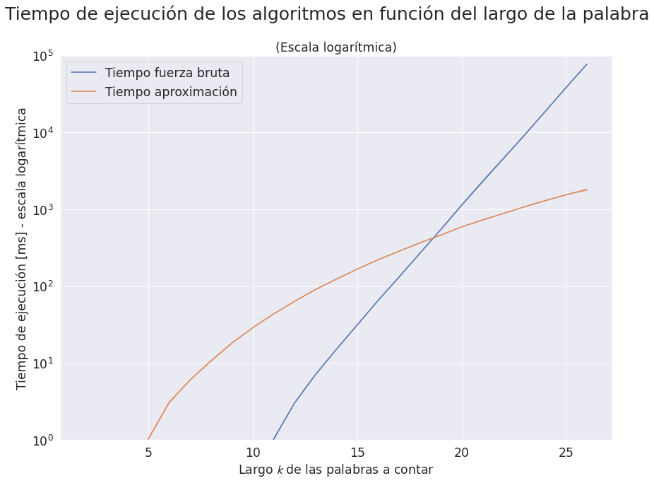
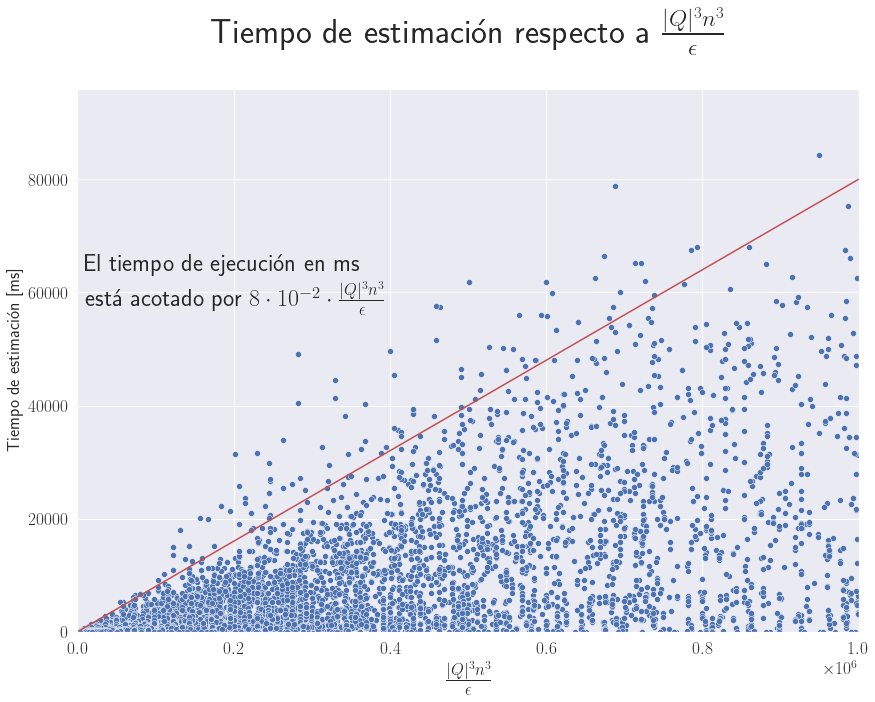
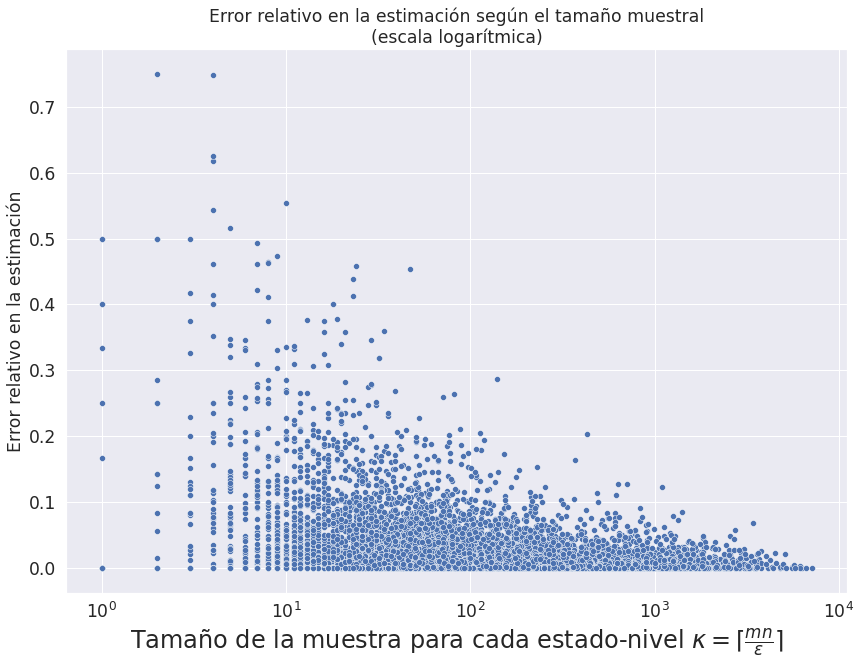

# #NFA FPRAS

Implementación de código para el paper **#NFA admits an FPRAS: Efficient Enumeration, Counting,
and Uniform Generation for Logspace Classes**, de Marcelo Arenas, Luis Alberto Croquevielle,
Rajesh Jayaram y Cristian Riveros.

# Estructura del proyecto

## Python

La carpeta [`nfa_lib`](nfa_lib/) contiene una implementación en Python de este algoritmo.
El archivo `nfa.py` modela una clase `NFA` con todos los métodos
necesarios para ejecutar el algoritmo, junto con algunas utilidades para 
la generación de instancias de NFAs aleatorias. Además, implementa
una función _baseline_ para el conteo de palabras mediante fuerza bruta.

El desglose de las funcionalidades es el siguiente:

- Clase `NFA`: 
    Hereda de la clase `FA` (Finite Automaton) que, a su vez, hereda de `Automaton`.
    Esta clase está inspirada en la librería [automata](https://github.com/caleb531/automata).
    Modela un NFA sin epsilon transiciones e implementa los métodos necesarios para estimar 
    la cantidad de palabras de un determinado largo aceptadas por el NFA.
    - Método `__init__`: inicializa la instancia de un NFA y remueve estados inútiles (inalcanzables 
    y sumideros)
    - Método `read_input`: retorna la configuración de estados tras leer el string provisto, 
    comenzando por el conjunto de estados iniciales
    - Método `reachable`: retorna True si la configuración de estados tras leer el string provisto 
    contiene el estado provisto como parámetro
    - Métodos `remove_unreachable_states` y `remove_sink_states` remueven estados inalcanzables y 
    sumideros
    - Método `unroll`: "estira" un NFA en n niveles (n = largo del string de input) para estimar
    la cantidad de strings aceptados de largo n.
    - Métodos `compute_n_for_single_state` y `compute_n_for_states_set`: calculan una estimación 
    para el número de strings que llevan a un estado o a un conjunto de ellos, respectivamente
    - Método `sample`: muestrea un símbolo de forma aleatoria. Se llama recursivamente para 
    construir un string aleatorio y utilizarlo como muestra para el conteo de aceptación
    - Método `count_accepted`: para cada estado y nivel, muestrea una cantidad fija de strings y 
    computa estimaciones para la cantidad de aceptados. Retorna la estimación para N sobre el 
    conjunto de estados finales, es decir, la estimación de la cantidad de strings aceptados por el 
    NFA. Recibe un parámetro de error `eps` y un múltiplo para `kappa`, que modula la cantidad
    de muestras de string por cada estado y cada nivel
    - Método `bruteforce_count_only`: usa fuerza bruta para probar cada string de largo n y 
    contabilizarlo de forma exacta. Tarda tiempo exponencial en n
    - Método `plot`: dibuja el autómata usando la librería `graphviz`. Funciona bien en un ambiente 
    Jupyter Notebook
    - Método `random`: método estático, se debe llamar como `NFA.random(...)`. Genera una instancia 
    aleatoria de un NFA con la cantidad de estados y densidad de transiciones provista.
    - Método `to_networkx`: retorna un multigrafo dirigido mediante la librería `networkx`
    - Método `cycle_height`: calcula la "altura de ciclo" del autómata, según se describe en 
    [este paper](https://doi.org/10.1016/j.ic.2021.104690). 
    El resultado del paper indica que si la altura 
    de ciclo es finita, entonces la cantidad de palabras aceptadas por el NFA (densidad de 
    aceptación) es polinomial en dicha altura. En particular, está acotada por un polinomio de grado 
    uno menos que la altura de ciclo. Si, por el contrario, la altura de ciclo es infinita, entonces
    la densidad _puede_ ser exponencial (y también polinomial).
    - Método `fron_random_matrix`: método estático, lee una matriz aleatoria y binaria NumPy e interpreta 
    de ella la cantidad de estados, las transiciones, los estados iniciales y finales
    - Método `to_text`: utilizado para serializar el NFA en el formato leido por la implementación en C++
- Método `count_nfa`: wrapper de `count_accepted`. Llama a `unroll` y retorna la 
estimación de la cantidad de palabras aceptadas para el largo n provisto. 
- Método `random_matrix_for_nfa`: genera una matriz NumPy aleatoria que representa las transiciones
que usan el símbolo `'0'`, aquellas que usan el `'1'`, los estados iniciales y finales. Puede ser usada para 
instanciar un NFA aleatorio con la ayuda del método estático `NFA.from_random_matrix`.

### Ejemplos de uso

```python
nfa = NFA(
    states={'0', '1', '2', '3', '4', '5', '6'},
    input_symbols={'0', '1'},
    transitions={
        '0': {'0': {'1'}, '1': {'3'}},
        '1': {'0': {'2'}},
        '2': {'0': {'0'}, '1': {'3'}},
        '3': {'0': {'4'}},
        '4': {'0': {'5'}},
        '5': {'0': {'3'}},
        '6': {'1': {'4'}},
    },
    initial_states={'0', '1', '5', '6'},
    final_states={'2', '4', '6'}
)
# Calcular con fuerza bruta la cantidad de strings de largo 6
# aceptados por el NFA
nfa.bruteforce_count_only(6) 
# Graficar el NFA "estirado" para un largo 6 (con 6 niveles)
# (necesita Jupyter)
nfa.unroll(6).plot()
# Calcular la altura de ciclo del NFA
nfa.cycle_height()
# Calcular la cantidad de strings de largo 55 aceptados por el NFA
# utilizando un parámetro epsilon = 1500 y múltiplo de kappa = 1 (default)
count, nfa_unroll = count_nfa(nfa=nfa, n=55, eps=1500)
```

## C++

La implementación en C++ es más eficiente en recursos y tiempo que la versión Python.
Implementa los mismos métodos de forma casi idéntica, utilizando la misma API.
Recibe input por `stdin` e imprime los resultados a `stdout`.

### Compilación

```bash
cd cpp
make
```

Esto compila el programa `main`.

### Ejecución

```bash
# En el directorio cpp
# Para calcular con fuerza bruta + la estimación
./main < input.txt
# Para calcular solo la estimación
./main 0 < input.txt
```

### Formato del input

La primera línea del input consiste en cuatro parámetros separados por espacio:
`n`, `epsilon`, `kappa_multiple` y `phi_multiple`.
Estos controlan el largo de los strings a contabilizar, el parámetro de error,
el múltiplo de kappa (cantidad de strings a muestrear) y un parámetro
para modular la probabilidad de rechazar la muestra, respectivamente.

La segunda línea se compone de tres números separados por espacio: `E` `A` `T`.
El primero indica la cantidad de estados, el segundo el tamaño del
alfabeto (normalmente 2, es binario), y el tercero la cantidad de
transiciones.

La tercera línea contiene `E` números separados por espacio, que corresponden
a las etiquetas de los `E` estados. Estas etiquetas son fundamentales, pues
deben ser consistentes con las transiciones, estados iniciales y finales.
Además, el orden en que se escriben es importante. No es necesario que sea en
orden creciente, sin embargo se asume este orden para la declaración de estados
iniciales y finales.

La cuarta línea contiene `E` números 0 o 1, separados por espacio, 
que representan si el estado `E_i` es inicial (con valor 1) o no (valor 0). 
Este es el mismo orden con que se ingresaron las etiquetas de los estados.

La quinta línea contiene `E` números 0 o 1, separados por espacio, 
que representan si el estado `E_i` es final (con valor 1) o no (valor 0). 
Este es el mismo orden con que se ingresaron las etiquetas de los estados.

La sexta línea contiene `A` números separados por espacio, que corresponden a las etiquetas
para los símbolos del alfabeto de tamaño `A`. Estos símbolos deben ser consistentes
con la notación de las transiciones, detallada a continuación.

Las siguientes `T` líneas se componen de tres números separados por espacio, `p` `a` `q`.
Corresponden a las `T` transiciones, en las que el primer número se refiere al estado
de origen `p` por su etiqueta, el segundo número `a` es un símbolo del alfabeto y el
tercero corresponde al estado de destino. Es decir, representa una transición entre el estado
`p` y `q`, que ocurre al leer el símbolo `a`.


Un ejemplo del input se encuentra en [`cpp/input.txt`](cpp/input.txt). En este caso,
se busca estimar la cantidad de strings de largo 25 aceptados por un autómata con 3 estados y 8 
transiciones, bajo un alfabeto binario.
Usa un parámetro de error `epsilon=0.1`, un múltiplo de kappa igual a 1, y un `phi_multiple`
de 500.

### Diferencia con la implementación Python

La principal diferencia es la inclusión del parámetro `phi_multiple`, que tiene efecto en
 la línea 336 de [`nfa.cpp`](cpp/nfa.cpp). Este parámetro modula la probabilidad de
 hacer `rejection sampling`: mientras más alto, se rechazan menos muestras de strings,
 con el riesgo de sesgar la generación uniforme. Permite mayor eficiencia en las muestras
 para un parámetro de error `epsilon` dado, por lo que es recomendable dejarlo en valores
 altos (> 100) cuando existen limitaciones de tiempo de ejecución. 

### Ejemplo de output

Con el input de ejemplo [`cpp/input.txt`](cpp/input.txt), la ejecución
```bash
./main < input.txt
```
retorna el siguiente resultado:
```
retries_per_sample 666064
sample_size 19000
sample_misses 0
sample_hits 1425000
miss_ratio 0
bruteforce 2143647
bruteforce_time 78651
estimation 2146243
estimation_time 24522
```

`retries_per_sample` corresponde a la cantidad de veces que se intentará nuevamente
un muestreo rechazado. Este valor depende de kappa, mediante la función `retries_per_sample(kappa)`, 
y normalmente es muchísimo más alto de lo necesario. Para este caso particular, el múltiplo de phi,
 que controla la probabilidad de rechazo es tan alto (cuarto parámetro de la primera línea, =500) 
 que no se rechaza ningún muestreo. La cantidad de muestreos rechazados se reporta en 
 `sample_misses`, mientras  que la cantidad de muestreos exitosos se reporta en `sample_hits`. 
 El valor `miss_ratio` es el cociente entre las últimas dos cantidades.

 `bruteforce` corresponde al conteo exacto por fuerza bruta, mientras que `bruteforce_time` reporta
 el tiempo de ejecución en milisegundos para este método.

 Análogamente, `estimation` imprime la estimación de la cantidad de strings de largo 25 aceptados, 
 mientras que `estimation_time` reporta su tiempo de ejecución en milisegundos.

En este caso particular, el error relativo es de `0.00121`.

# Guidelines sobre los parámetros

La unidad básica del tiempo de ejecución del algoritmo es el tiempo necesario para hacer un sample.
Este tiempo es aproximadamente lineal en el largo de la palabra `n`. El segundo factor importante
es la cantidad total de muestras que realiza el algoritmo, que depende de tres parámetros y dos constantes.

El primer parámetro es `epsilon`, que afecta al valor compuesto `kappa`, cuya ecuación es `⌈n*m/epsilon⌉`.
En ella aparecen también las dos constantes, `n` y `m`, que corresponden al largo del string
y a la cantidad total de estados en la versión "estirada" (`unroll`) del NFA, respectivamente.
 `m`, a su vez,  está acotado por `|Q| * n`. Puede ser menor a esta cantidad por la introducción de estados 
 inalcanzables o sumideros al estirar el NFA, que son removidos antes de ejecutar la estimación.

El segundo parámetro que controla el tiempo de ejecución es `kappa_multiple`, que afecta de forma
directa la cantidad de muestras que se acumulan por cada estado en NFA unroll. 

Por último, el tercer parámetro es `phi_multiple`. Mientras mayor sea su valor,
 menor es la probabilidad de rechazo de una muestra, con lo cual
`miss_ratio` tiende a cero y las muestras se tornan más eficientes (aunque posiblemente sesgadas).

Para ambientes en que el tiempo de ejecución es la variable que se desee mantener acotada, la recomendación
es mantener `sample_misses` en 0, mediante un `phi_multiple` alto, cercano a 500. `epsilon` debería ser
lo más bajo posible que permita mantener el tiempo de ejecución bajo los límites.

Finalmente, `kappa_multiple` debe quedar en 1 para simplificar los cálculos, en tanto su efecto es exactamente contrario a `epsilon`.



El algoritmo de aproximación tiene un _overhead_ importante para largos `n` menores a 20.

Para las instancias más generales de NFAs, con cualquier número de estados y transiciones, se ha observado
 que el algoritmo de fuerza bruta (exacto) es más rápido que el algoritmo aproximado para largos menores a 20.
 
 | En NFAs generales, se recomienda el uso del algoritmo de aproximación solo para valores `n` superiores a 20.



Experimentalmente, para un CPU Intel i7 6700K @ 4.5 GHz, se obtiene que el tiempo de ejecución (en ms)
del algoritmo de aproximación está acotado por arriba por `8e-2 |Q|^3 n^3 / epsilon`.
Así, si se busca un tiempo de ejecución de 5000 milisegundos para un NFA con 1000 estados
útiles y largo `n=25`, se necesitaría `epsilon=2.5e8`

### Eficiencia del tamaño muestral



Se observa una relación inversa entre el error relativo y el tamaño muestral, que escala aproximadamente con el logaritmo del tamaño muestral.